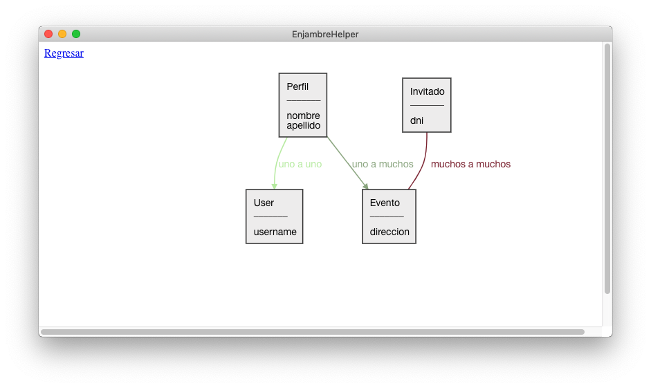

# enjambre-helper

El objetivo de este proyecto es simplificar algunas tareas que generalmente
hacemos cuando estamos desarrollando backends con django.

Por ejemplo, cuando inspeccionamos un proyecto o buscamos hacer cambios,
generalmente necesitamos entender el modelo de datos, saber cómo se relacionan
los modelos, qué atributos tienen etc...

Para eso, este proyecto sabe realizar esta clase de diagramas:



## Cómo iniciar este proyecto

Deberías clonar el repositorio, y luego ejecutar este comando:

```
make iniciar compilar
```

Y si estás desarrollando, podrías simplemente usar el comando
`make ejecutar` y editar el código o los tests. Tené en cuenta
que cuando ejecutas `make ejecutar` el proyecto que se
muestra en pantalla sale de un fixture de datos.
